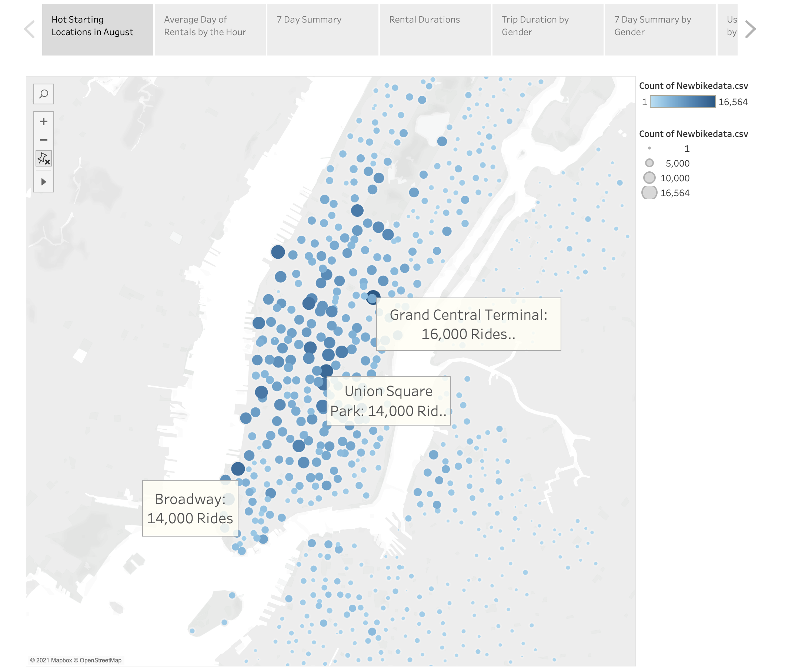
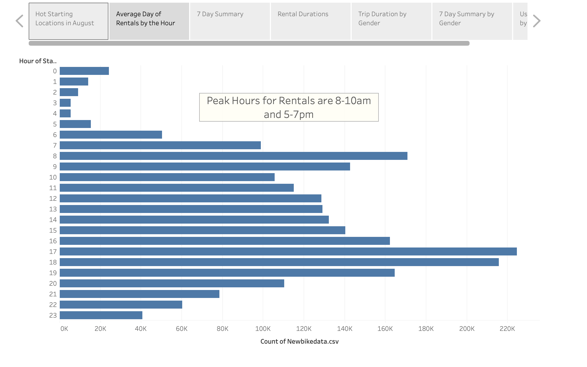
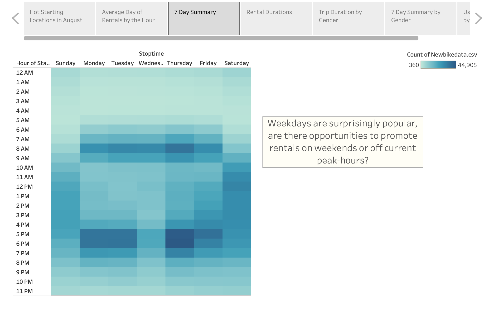
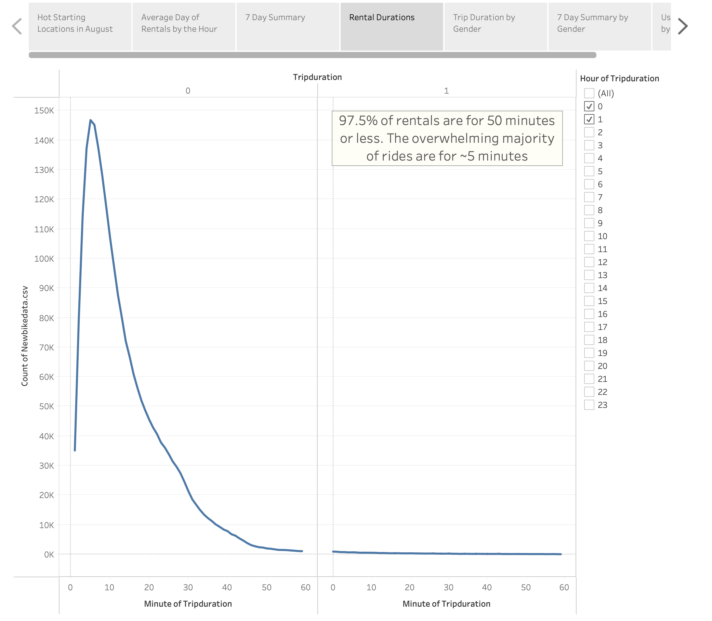
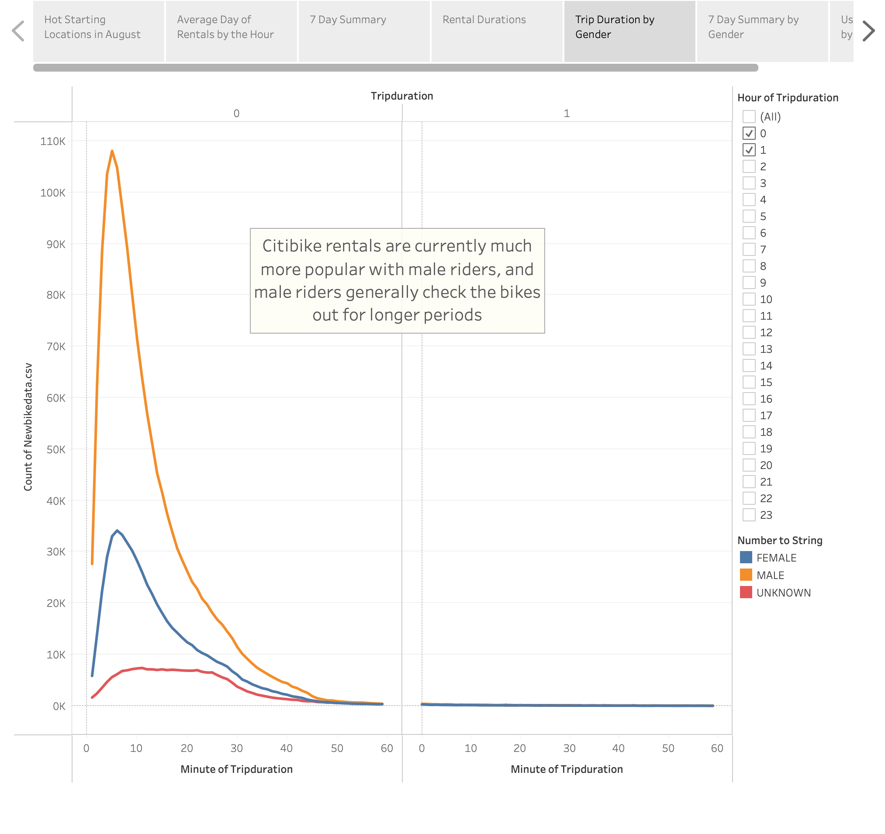
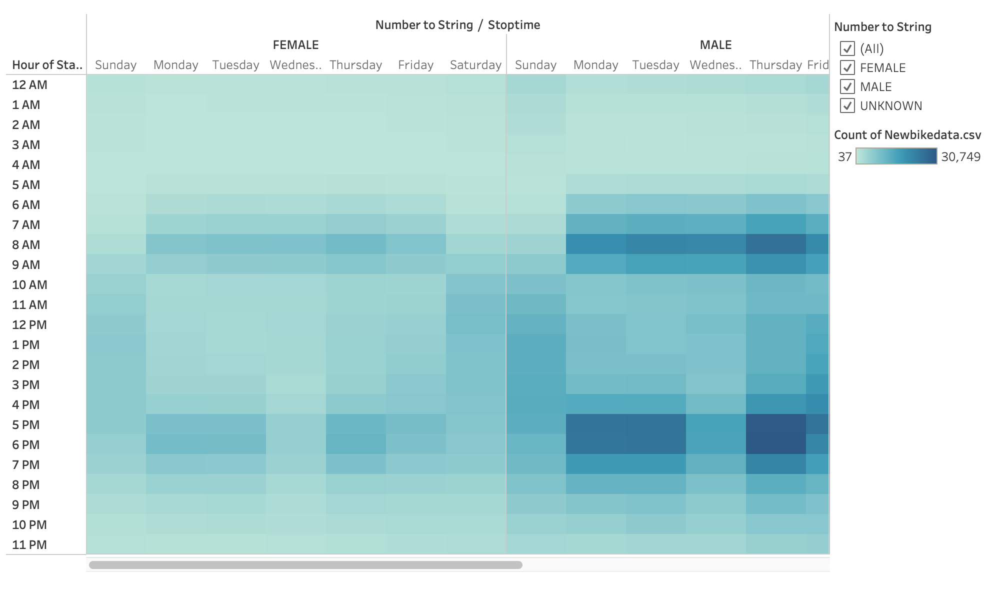
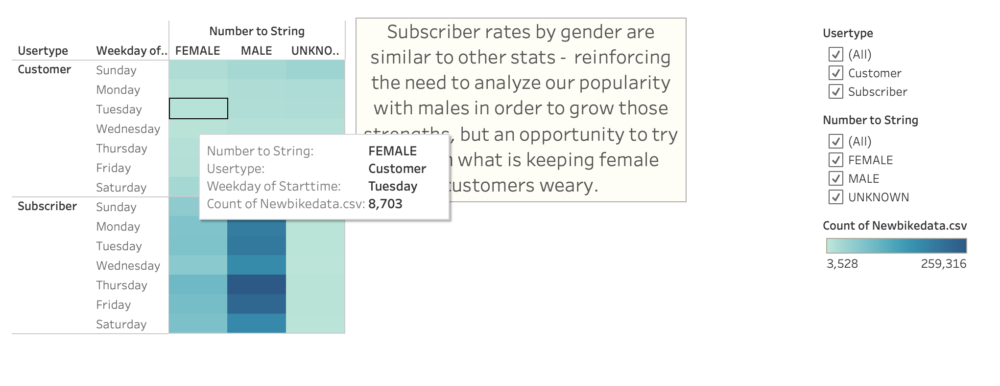

# bikesharing by Ben Altshuler

## Overview

We looked at a slice of Citibike bike rental data from August 2019 in an effort to see if this concept could be implemented in Iowa. Trends were sought by stratifying the data across time of day, location, user status (subscriber or guest), gender, and rental duration. 

## Results

- Link to Tableau Dashboard

[Link to Dash](https://public.tableau.com/shared/9SHP9M63P?:display_count=n&:origin=viz_share_link)

Although we highlighted a few of the most popular spots to rent a bicycle, the data shows that tourist spots around Manhattan generate a large amount of demand. 

Here we highlighted the peak hours at rush-hour / commute times.

Zooming out a bit, this chart shows the rental trends throughout an average week. Predictably, we still see rush-hour peaks during weekdays, while the weekends are steady throughout the day. 

Most riders only need to travel a short distance quickly. A lot of rides are 5 minutes or less. 

Citibike is most popular in NYC with male riders.

Similar patterns emerge throughout the week for both genders. Rush-hour surges and steady daytime rentals on weekends. Males rent more often. 

Supports overall gender trend of greater male demand for bike rentals. More male subscribers. 

## Summary

This analysis dug down into the demographics and usage habits of males and female bike renters in NYC in August of 2019. Results were mostly intuitive: peak rental at peak travel times, mostly short trips from tourist target locations. One interesting takeaway is the stratification across genders; why are citibikes so much more popular among males? 

In order to determine if Citibikes can implement a similar operation in Iowa, they should first conduct analyses similar to this one on cities they know are demographically similar to their target city. New visualizations could compare weather, population age, and population gender between Des Moines and NYC (or a demographically / geographically closer city) in order to offer a more honed take. 

